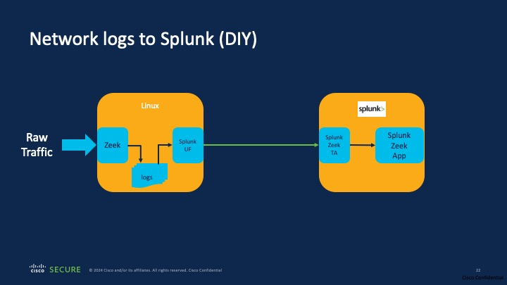
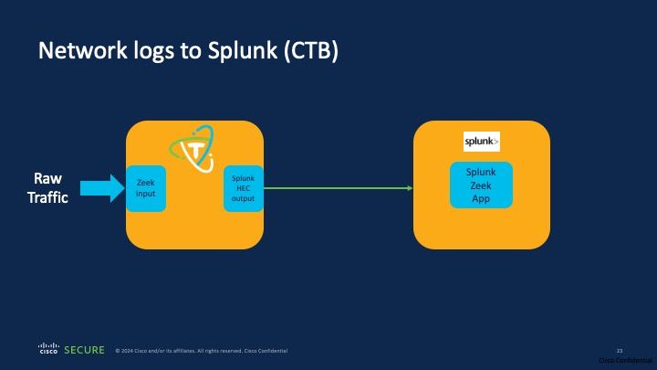

# Network telemetry to Splunk

Network telemetry is one of the most important tools in a Security practitioner's arsenal. Network telemetry is a very loose term that could encompass everything from raw traffic data (which is a complete digital copy of everything that is on the wire) to summarized network activity in the form of Network flow data or transaction logs like Zeek logs. 

Zeek processes raw network traffic data to extract high-fidelity summarized transaction logs that include detailed analysis of the network activity such as what protocols were active, details about the protocols such as DNS queries and responses and file content analysis if access to the files was possible.

Here are few notes about Zeek:
* Zeek is one of the most popular open-source tools and is widely used for network forensics.
* Many Network Detection & Response (NDR) companies use Zeek for collecting summarized network activity data and then build analytics on top of that data.
* Splunk has a few Zeek apps in their App Store.
* We will be using the **Zeek App for Hunting** to visualize the Zeek data in Splunk.

## Traditional Approach

If a network security practitioner wanted to send Zeek data into Splunk, it would require a fair bit of manual setup to accomplish that. The diagram below shows the various steps that are typically needed.

Typical steps needed:
1. Connect a source of raw network traffic to a Linux box, say (SPAN port or mirror port from a switch/router)
2. Download, install, configure and run Zeek on the system to process the raw network traffic data
3. Download, install, configure and run the Splunk Universal Forwarder to process Zeek logs
4. Configure and connect the Splunk Universal Forwarder to your Splunk system
5. Optionally setup the Zeek TA for Splunk to pre-process the Zeek event data as they come in
6. Configure the **Zeek App for Hunting** to process data from the Zeek TA.
7. Additional scripting and setup will be needed on the Linux box for automated start/restart
8. Additional tools must be installed for collecting statistics about the volume of processed data and the like

All of the steps above are DIY and require substantial amounts of learning, experimentation and debugging to get right.

## CTB Approach

The Cisco Telemetry Broker (CTB) simplifies the ingest of raw traffic, its conversion to Zeek logs, transmission of Zeek logs to Splunk and ingest into the Splunk Zeek app using a simple-to-use graphical interface (or API). See diagram below.

One of the key advantages of CTB is that this capability can be developed by anyone who is familiar with the CTB platform architecture. For the rest of this Workshop, we will delve into how one can develop capabilities like this using the CTB platform and we will showcase this in this Devnet workshop.

### CTB Plugins

Central to CTB's architecture are Plugins. Plugins are components which add specific capabilities to the CTB platform. This Plugin-based architecture also allows for easy extensibility of CTB's capabilities in the future.

There are two main types of Plugins present in CTB today, Input Plugins and Output Plugins.
* Input Plugins allow for Telemetry to retrieved from sources (Pull mode) or to process telemetry that is pointed at CTB (push mode).
* Output Plugins do the inverse of the Input plugins. They allow for processed telemetry from CTB to be sent to a destination (push mode) or allow destinations to connect to CTB and pull the telemetry from CTB (pull mode).

In this Workshop, the Zeek plugin is an Input plugin and the Splunk HEC plugin is an Output Plugin. Both Plugins operate in Push mode.

* There is a a third type of plugin called "Processor plugins" which is present in the underlying CTB telemetry engines, but is not yet exposed to the UI. This functionality is super powerful and allows for dynamic transformations of telemetry and is expected some time later this year.

### CTB Input Plugin Design

Like mentioned before, Input plugins are designed to process telemetry from sources and report statistics on their processing. The CTB architecture allows for creation of custom Input plugins using the `Generic Input Framework`. There are a number of input plugins that are present internally within CTB as part of the telegraf application , but users can also create custom plugins if any special processing of telemetry is needed. Telegraf currently doesn't have an inbuilt Zeek generaotor plugin, so we built one ourselves.

The process for creating a new Input plugin in CTB is as follows:
1. Create a new Input type that defines the plugin's capabilities using the CTB Manager API
2. Install the plugin application on one or more Broker nodes
3. Create the hooks necessary to monitor for any new instances of the plugin that get created via the UI
4. Create start/stop capabilities for the plugin
5. Determine what statistics to report about the operation of the Plugin and report that via the API

### CTB Output and Processor Plugins

Output plugins are designed to take processed telemetry from an Input plugin and send them to a Destination. Similar to input plugins, there are a number of output plugins that are present internally as part of the `telegraf` application. For this workshop, we extended the HTTP output plugin in telegraf to send data to Splunk using the Splunkevent format.

In addition to input and output plugins, there are Processor plugins which transform data using a variety of operations, such as adding/dropping fields, changing key names, and so on. Again, `telegraf` supports a number of operatiors natively and it is easy to enable them in any pipeline.

## [Setup and Input Plugin](02-Zeek-Splunk-Input-Plugin.md)