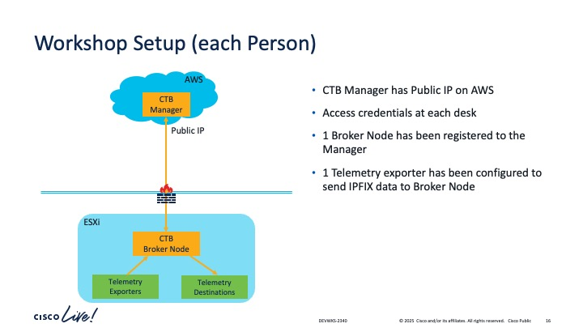

# Cisco Live EMEA 2025

## Ingesting Network Security Telemetry into Splunk using Cisco Telemetry Broker [DEVWKS-2478]

Welcome to this Devnet session on the Cisco Telemetry Broker.

The Cisco Telemetry Broker optimizes your telemetry pipelines for the hybrid cloud. It vastly simplifies the consumption of telemetry data for our customers' business critical tools by brokering hybrid cloud data, filtering unneeded data, and transforming data to a usable format for optimal consumption by analytical tools like Splunk.

In this Lab, the participant will learn how to use the Cisco Telemetry Broker to generate network security telemetry (aka Zeek logs) from raw traffic and feed it into the Splunk dashboard for network security visualization - Cisco and Splunk - better together!

At the end of this Lab, you will be able to:
* Install a Zeek traffic generator on a CTB Broker Node
* Configure a new Zeek Input type using CTB's APIs
* Create a new Zeek input instance
* Connect the Zeek input instance to the Splunk HEC output
* Show how statistics from the Input instance are reported back
* Visualize Zeek traffic on the Splunk Dashboard using the Zeek App

## Cisco Telemetry Broker Overview

Let's start off with some basic concepts of CTB.

[CTB Basic Concepts](docs/DEVWKS-2478-CTB-Introduction.pdf)

The document above explains the following concepts about CTB:
* The telemetry problem
* How CTB enables the Intelligent Telemetry Plane
* Democratization of telemetry
* CTB capabilities - Brokering, Filtering, Transformation
* CTB architecture and components (very high level)
* Deployment specifications
* Typical deployment scenario

## Lab Setup

The diagram above shows how the DEVWKS 2478 lab has been setup.
* CTB Manager is on AWS with a Public IP. Each person has their own CTB Manager
    * Access to the CTB Manager is via the UI
    * Access credentials are placed on the table
* A CTB Broker node running on a private ESXi server is connected to the CTB Manager
* Telemetry exporters have been configured to send telemetry to all Broker Nodes
    * This is the push model where telemetry is sent to CTB
* Broker nodes can be configured to pull telemetry, say from AWS VPC flow logs
    * This is the pull model where CTB can reach out and get telemetry from sources

## [Network telemetry to Splunk](01-Zeek-Splunk-Introduction.md)